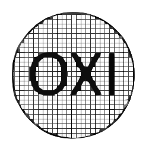

<h1 align="center">Oxikara</h1>
<p align="center">
  
</p>
<p align="center">
  A high-performance C++ MIDI visualizer with real-time playback.
</p>

## Preview


## Features
- Threaded MIDI parsing (runs on a worker thread)
- Real-time audio output (KDMAPI / WinMM fallback)
- Non-overlapping note loading
- Adjustable MIDI event processing per frame

## Bootstrap (Windows)
Run:
```bat
build.cmd
```

## Run
```powershell
.\build\Release\oxikara.exe --midi path\to\song.mid
```

Optional:
- `--max-midi-events-per-frame N` (default `4096`) to limit per-frame MIDI dispatch spikes.

## Parsing info (console)
On load, Oxikara now prints:
- track count
- channel/meta/sysex event counts
- total notes loaded
- ignored overlapping note-ons
- tempo change count

Parsing itself runs on a worker thread.

## Audio backend order
1. KDMAPI (OmniMIDI): `InitializeKDMAPIStream` + `SendDirectData`
2. WinMM fallback (`midiOutShortMsg`)

## Renderer
- GLFW + OpenGL
- Vulkan swapchain renderer (no OpenGL backend).

